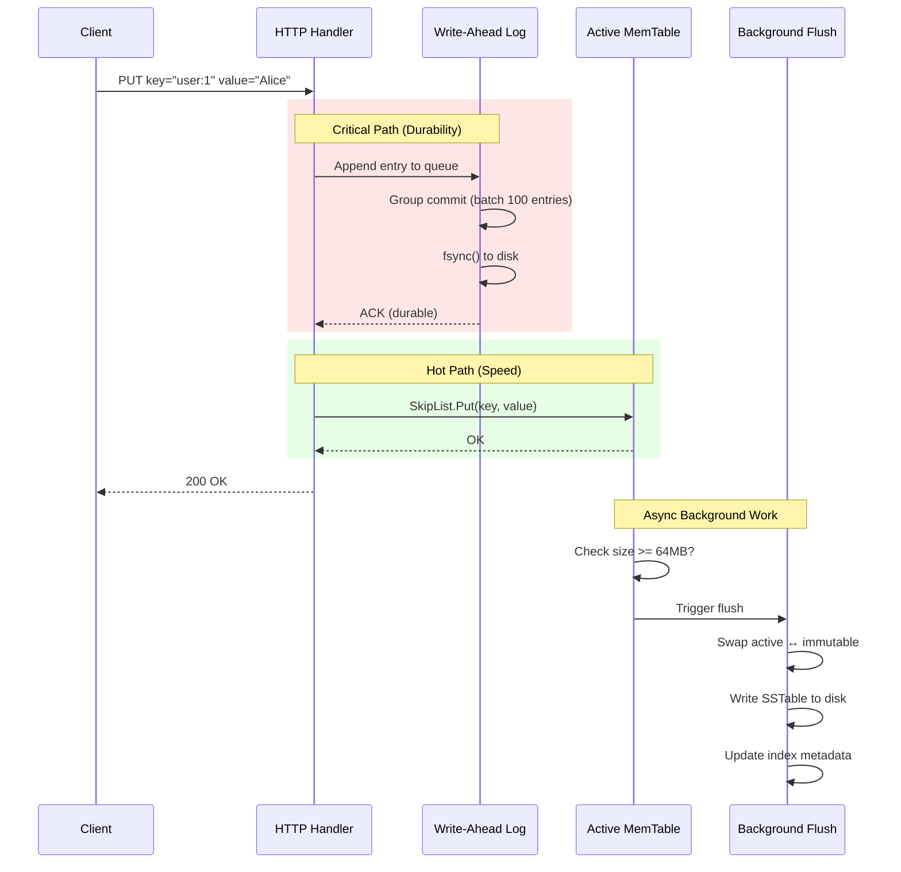
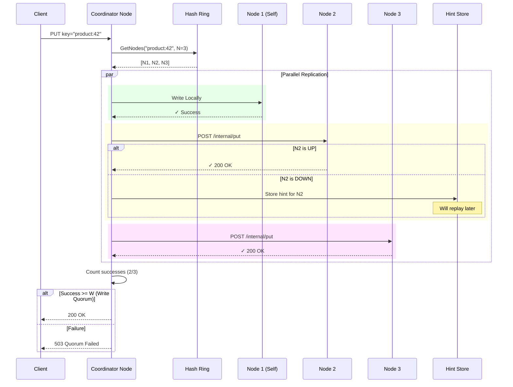
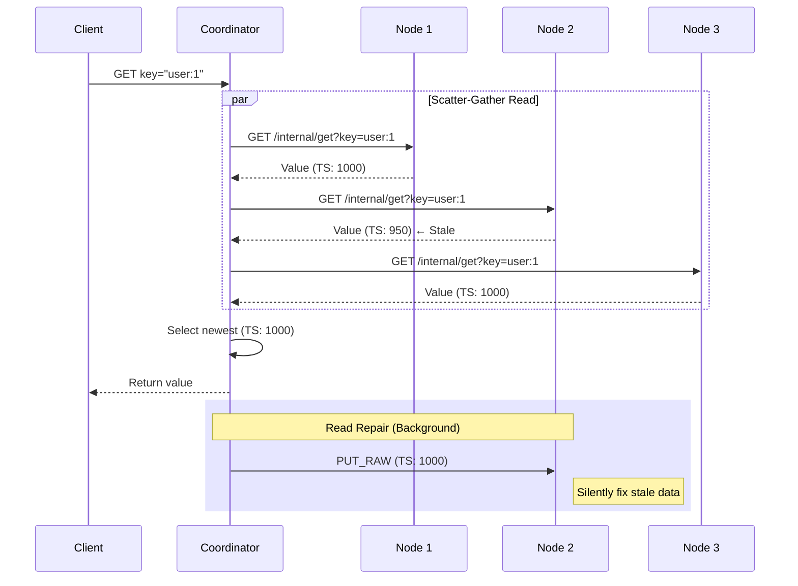
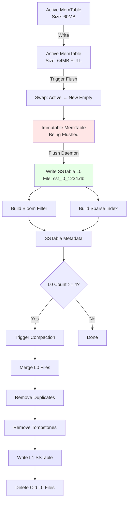
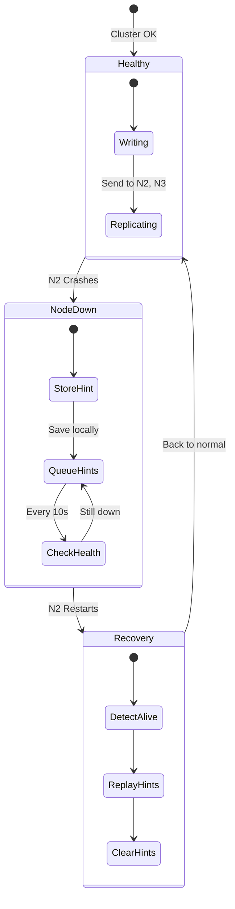

# kv-store Architecture & Design Document

## Table of Contents
1. [System Overview](#system-overview)
2. [Core Components](#core-components)
3. [Data Flow Diagrams](#data-flow-diagrams)
4. [Storage Engine Internals](#storage-engine-internals)
5. [Distributed Architecture](#distributed-architecture)
6. [Crash Recovery & Reliability](#crash-recovery--reliability)
7. [Performance Optimizations](#performance-optimizations)

---

## System Overview

kv-store is a **distributed, highly available key-value store** built on principles from **Dynamo (Amazon)** and **Cassandra**, with a **high-performance LSM-tree storage engine** inspired by RocksDB and LevelDB.

### Design Philosophy

**Core Principles:**
-  **Write-Optimized**: Uses LSM-tree with Group Commit WAL
-  **Crash-Proof**: Write-Ahead Logging ensures zero data loss
-  **Distributed**: Consistent hashing with tunable replication (N/R/W)
-  **High Performance**: Arena-based memory allocation, O(1) LRU cache, lock-free reads
-  **Self-Healing**: Read repair and hinted handoff for automatic recovery

### Key Metrics
| Metric | Target | How Achieved |
|--------|--------|--------------|
| **Write Throughput** | 10,000+ ops/sec | Group Commit WAL + Arena Allocator |
| **Read Latency (P99)** | < 5ms | LRU Cache + Bloom Filters + Sparse Indexing |
| **Data Loss** | Zero | WAL + fsync before ACK |
| **Availability** | 99.9%+ | Hinted Handoff + Sloppy Quorum |

---

## Core Components

### 1. Storage Engine (LSM-Tree)

The storage engine uses a **Log-Structured Merge Tree** with multiple levels:

```
┌─────────────────────────────────────┐
│         Write Path                  │
├─────────────────────────────────────┤
│  1. Write-Ahead Log (Durability)    │ ← Append-only, Group Commit
│  2. MemTable (Speed)                │ ← In-memory SkipList with Arena
│  3. Immutable MemTable (Handoff)    │ ← Being flushed to disk
│  4. SSTables L0-L4 (Persistence)    │ ← Sorted immutable files
└─────────────────────────────────────┘

┌─────────────────────────────────────┐
│         Read Path                   │
├─────────────────────────────────────┤
│  1. Active MemTable                 │ ← Fastest
│  2. Immutable MemTable              │ ← Fast
│  3. LRU Cache (256MB)               │ ← Fast
│  4. L0 SSTables (newest → oldest)   │ ← Bloom Filter + Sparse Index
│  5. L1-L4 SSTables                  │ ← Bloom Filter + Sparse Index
└─────────────────────────────────────┘
```

### 2. Arena Allocator

**Problem**: Go's GC scans every object on the heap. With millions of small K/V pairs, GC pauses can reach 100ms+.

**Solution**: Arena allocator pre-allocates a large byte slice (64MB) and manages it manually.

```
Traditional Heap Allocation:          Arena Allocation:
┌─────┬─────┬─────┬─────┐            ┌─────────────────────────────┐
│ K/V │ K/V │ K/V │ ... │            │ [All K/V pairs packed here] │
└─────┴─────┴─────┴─────┘            └─────────────────────────────┘
  ↓      ↓      ↓      ↓                        ↓
  GC scans 1M objects                  GC scans 1 object
  = 100ms pause                        = 1ms pause
```

**Implementation**: `arena.go` uses atomic CAS for lock-free allocation.

### 3. Write-Ahead Log (WAL)

**Purpose**: Crash resilience. Every write hits the WAL before ACK.

**Group Commit Optimization**:
```
Without Group Commit:        With Group Commit:
─────────────────────        ─────────────────
Request 1 → fsync (10ms)     Request 1 ┐
Request 2 → fsync (10ms)     Request 2 ├→ Buffer (2ms) → fsync (10ms)
Request 3 → fsync (10ms)     Request 3 ┘
─────────────────────        ─────────────────
Total: 30ms for 3 writes     Total: 12ms for 3 writes
Throughput: 100 ops/sec      Throughput: 250 ops/sec
```

---

## Data Flow Diagrams

### Write Path - Single Node



### Write Path - Distributed (3 Replicas)



### Read Path - Multi-Version Resolution



### Flush & Compaction Flow



---

## Storage Engine Internals

### SkipList with Arena (MemTable)

**SkipList Structure**:
```
Level 3:  HEAD ──────────────────────────> [key:900] ──> NULL
Level 2:  HEAD ──────────> [key:400] ───> [key:900] ──> NULL
Level 1:  HEAD ──> [key:100] > [key:400] > [key:700] > [key:900] ──> NULL
Level 0:  HEAD > [key:50] > [key:100] > [key:200] > [key:400] > [key:700] > [key:900] > NULL
```

**Arena Layout**:
```
┌──────────────────────────────────────────────────┐
│ Arena (64MB continuous memory)                   │
├──────────────────────────────────────────────────┤
│ Offset 0:    [key: "user:1"]  [value: "Alice"]   │
│ Offset 24:   [key: "user:2"]  [value: "Bob"]     │
│ Offset 48:   [key: "user:3"]  [value: "Charlie"] │
│ ...                                               │
│ Offset 63MB: [free space]                        │
└──────────────────────────────────────────────────┘
       ↑                    ↑
       Node stores offset, not pointer
       → No GC scanning needed!
```

### SSTable File Format

```
┌────────────────────────────────────────┐
│ SSTable File (sst_l0_12345.db)         │
├────────────────────────────────────────┤
│ Entry 1:                               │
│   [keyLen: 4B][valLen: 4B]             │
│   [key bytes][timestamp: 8B][value]    │
│                                        │
│ Entry 2:                               │
│   [keyLen: 4B][valLen: 4B]             │
│   [key bytes][timestamp: 8B][value]    │
│                                        │
│ ... (sorted by key)                    │
│                                        │
│ Metadata (in-memory):                  │
│   • Bloom Filter (64KB)                │
│   • Sparse Index (every 128 keys)      │
│   • MinKey, MaxKey (range bounds)      │
│   • Open file descriptor              │
│   • Reference count (for safe delete)  │
└────────────────────────────────────────┘
```

### Reference Counting for Safe Deletion

**Problem**: Reader thread opens SSTable, compaction deletes it → Crash!

**Solution**: Reference counting with atomic operations:

```go
// Before reading
if !sstable.Acquire() {
    return // File marked for deletion
}
defer sstable.Release()

// Now safe to read, even if compaction happens
data := sstable.file.ReadAt(...)

// After compaction
sstable.MarkDeleted()  // Sets flag, doesn't delete yet
// File deleted ONLY when refCount hits 0
```

---

## Distributed Architecture

### Consistent Hash Ring

```
                    Hash Space (0 to 2^32)
                   ┌─────────────────────┐
           Node A  │   Virtual Node A1   │
              ┌────┼─────────────────────┼────┐
              │    │   Virtual Node B1   │    │
         Node C    │                     │    Node B
              │    │   Virtual Node C1   │    │
              └────┼─────────────────────┼────┘
                   │   Virtual Node A2   │
                   └─────────────────────┘

Key "user:42" → Hash(user:42) = 2,451,023,876
                → Clockwise search → Virtual Node A2
                → Data goes to Node A, Node B, Node C (N=3)
```

**Virtual Nodes**: Each physical node owns 10 positions on the ring for better load distribution.

### Quorum Configuration

```
N = Replication Factor (total copies)
W = Write Quorum (must ACK before success)
R = Read Quorum (must read to get latest)

Strong Consistency:  W + R > N  (e.g., W=2, R=2, N=3)
High Availability:   W=1, R=1, N=3 (Eventual Consistency)
```

**Example Scenarios**:

| Config | Behavior | Use Case |
|--------|----------|----------|
| W=1, R=1 | Fast, tolerates 2 failures | Session store, cache |
| W=2, R=1 | Durable writes, fast reads | User profiles |
| W=2, R=2 | Strict consistency | Financial transactions |

### Hinted Handoff



**Hint File Format**:
```
hints/localhost_8082.hints:
  [keyLen:4][valLen:4][key][value]
  [keyLen:4][valLen:4][key][value]
  ...
```

---

## Crash Recovery & Reliability

### WAL Replay Process

```mermaid
flowchart TD
    A[Server Starts] --> B{WAL exists?}
    B -->|No| C[Create empty WAL]
    B -->|Yes| D[Open wal.log]
    
    D --> E[Seek to position 0]
    E --> F[Read header: keyLen, valLen, CRC]
    
    F --> G{Valid header?}
    G -->|No| H[Corrupted - Stop]
    G -->|Yes| I[Read key + value]
    
    I --> J[Verify CRC32]
    J --> K{CRC match?}
    K -->|No| H
    K -->|Yes| L[MemTable.Put(k,v)]
    
    L --> M{More entries?}
    M -->|Yes| F
    M -->|No| N[Recovery Complete]
    
    H --> O[Truncate at last valid]
    O --> N
    
    N --> P[Server Ready]
    
    style H fill:#ffcccc
    style N fill:#ccffcc
```

**Corruption Handling**:
1. Track `lastValidOffset` during replay
2. If CRC fails → Stop reading
3. Truncate file to `lastValidOffset`
4. Lost entries are only those after corruption (usually 0-10ms of data)

### Data Loss Prevention

**Scenarios**:

| Event | Data Loss? | Why? |
|-------|------------|------|
| Normal shutdown | **Zero** | Flushes before exit |
| Kill -9 (hard kill) | **~5ms** | Buffered WAL entries not fsynced |
| Power failure | **~5ms** | Same as above |
| Disk corruption | **Partial** | WAL has checksums, stops at corruption |
| All 3 nodes die | **~5ms** | Each node has local WAL |

**Guarantees**:
-  **If client receives 200 OK** → Data is on disk (via WAL fsync)
-  **If W=2 quorum** → Data exists on 2+ nodes
-  **After recovery** → All WAL-confirmed writes are present

---

## Performance Optimizations

### 1. Lock-Free Read Path

**Critical Optimization**: Reads do NOT hold locks during disk I/O.

```go
// OLD (BAD): Hold lock during disk read
sstMu.RLock()
val := sstable.file.Read(offset, size)  // 10ms disk I/O
sstMu.RUnlock()
// → All writes blocked for 10ms!

// NEW (GOOD): Acquire reference, release lock
sstMu.RLock()
sstable.Acquire()  // Atomic increment
sstMu.RUnlock()
// → Lock held for <1µs

val := sstable.file.Read(offset, size)  // 10ms, no lock
sstable.Release()
```

### 2. O(1) LRU Cache

**Why not just a map?**

```go
// Simple cache (used in many projects)
cache := make(map[string][]byte)
if len(cache) > 10000 {
    // How to evict? Must iterate all entries!
    for k := range cache {
        delete(cache, k)
        break  // Delete random item - not LRU!
    }
}
```

**Our LRU Implementation**:
```
Doubly Linked List (tracks access order):
  HEAD <-> [key3, data] <-> [key1, data] <-> [key7, data] <-> TAIL
                ↑ Most recent              Least recent ↑

Hash Map (for O(1) lookup):
  key3 → *Node
  key1 → *Node
  key7 → *Node

On Get(key1):
  1. Lookup in map → O(1)
  2. Move node to front of list → O(1)

On eviction:
  1. Remove tail node → O(1)
  2. Delete from map → O(1)
```

### 3. Bloom Filter Math

**Without Bloom Filter**:
```
Read non-existent key → Check 10 SSTable files
Each file: Seek (10ms) + Read (5ms) = 15ms
Total: 150ms latency
```

**With Bloom Filter**:
```
Read non-existent key → Check 10 Bloom Filters (in RAM)
Each filter: 0.1ms
Total: 1ms latency → 150x faster!
```

**False Positive Rate**:
```
Bloom size = Items × 10 bits
FP rate ≈ (1 - e^(-k×n/m))^k
        ≈ (1 - e^(-7×20000/200000))^7
        ≈ 0.008 (0.8%)
        
Meaning: 99.2% of "not found" keys skip disk entirely
```

---

## Configuration Tuning Guide

### Write-Heavy Workload

```env
MEMTABLE_SIZE=128MB          # Larger batches
WAL_COMMIT_INTERVAL=10ms     # More batching
MAX_L0_FILES=8               # Tolerate more files
BLOOM_SIZE_L0=1000000        # Larger filters
```

**Impact**: +50% write throughput, -20% read speed

### Read-Heavy Workload

```env
MEMTABLE_SIZE=32MB           # Flush frequently
WAL_COMMIT_INTERVAL=2ms      # Low latency
MAX_L0_FILES=2               # Keep L0 small
BLOOM_SIZE_L0=2000000        # Very low FP rate
```

**Impact**: +30% read speed, -10% write throughput

### Balanced Production

```env
MEMTABLE_SIZE=64MB
WAL_COMMIT_INTERVAL=5ms
MAX_L0_FILES=4
BLOOM_SIZE_L0=650000
SPARSE_INDEX_INTERVAL=128
```

---

